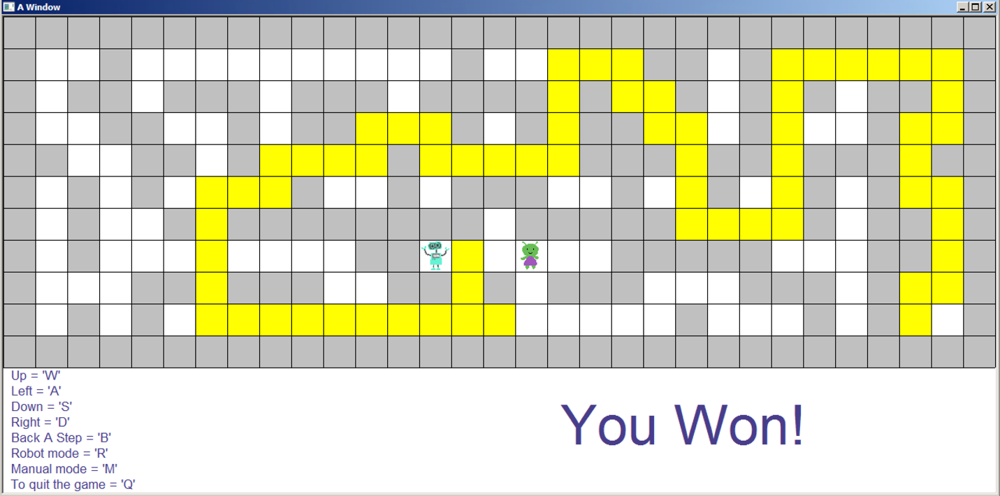

_In progress..._
# Alien Maze Game
This is a maze game created with C++ libraries. These libraries are used to read an input text file for a maze and then return a visual representation of the maze that changes as the player moves the robot around

The visual graphics were created using virtual studios and given [library.h](library.h) and [library.o](library.o) libraries to produce and modify graphics on windows. 

## Features
The maze could be constructed from a txt file that formats a maze with "~", "#", "+", and "$" characters. The "#" character represents the walls and the "~" represents an open path. The "$" represents the start of the maze, where the player begins, and the "+" represents the end of the maze, where the player needs to reach to win. 

With bmp images, the players location can be identified with an [robot](images/robot.bmp), the start with a [tiny home](images/robotHome.bmp), the end location with a [ship](images/ship.bmp), and the enemy chasing the player with a [alien](images/alien.bmp).

Utilizing the library functions, the "w", "a", "s", "d" keys are used by the player to move the alien from the start location. The program also saves the maze in an array to distinquish locations that have walls and prevent the player from going through them. 

The program is able to remember the path it is taking, marking the path with a yellow box at the end of the game and allowing the player to go back one step if the "b" character is typed. An automtic method is added because the program can rememeber its path. When the "r" key is typed, the robot will search for squares he has not gone to before and randomly pick one or, if there are no square it has not previously explored, it will take a step back and search again. 

The enemy following the robot will move one step as the robot moves one step. It contains a similar algorithm to the automatic mode implemented for the robot except it does not remember its path and therefore has a more random movment pattern.

In the manual, "m" character, setting or the automatic one, when the robot reaches the end the grame will end with a win. If the alien reaches the robot before it has reached the space ship, the game will end in a loss. If player ends the game with the "q" key, the game ends as is. 

## Results
The following images are the visual graphics implemented into the game windows and the screens as the game progresses.

### Start of the Game
The screen near the beginning of the game when the robot is moving within the maze, away from its home location and towards the end location with a ship.

### End of Game
The screen of the end of the game when the player types the "q" key.

### Game Won
The screen demonstrating how the program recognized the player reached the goal and avoided the alien representing a win.

### Game Lost
The screen demonstrating how the program recognized the alien has reached the robot before the robot reached the ship meaning the game ended with a loss.

